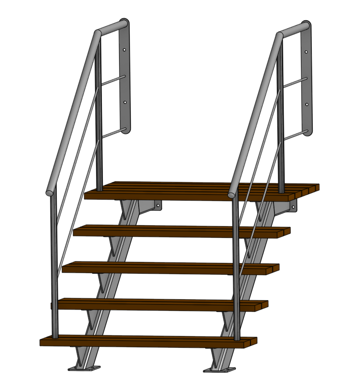

# Terrassetrappe

Dette er designdokumentation for en terrassetrappe til huset Søndre Landevej 71, 6400 Sønderborg.

Trappen dækker delvist over vinduerne i kælderen, så det er vigtigt at den ikke tager mere lys/udsyn end højst nødvendigt.  
Trappevanger og gelænder skal galvaniseres.  
Fliserne falder 15mm fra husmur til dér hvor vangerne støtter, så tegningerne er lavet fra et nulpunkt 15mm under fliseniveau ved muren.  
Vægbeslag til vanger er designet så murankre kommer til at sidde lodret centreret i mursten.

## Gelænder

Gelænderet er en stilmæssig kopi af gelænderet på vores fortrappe. De lodrette støtter i gelænderet (30x30 afrundet) havde jeg håbet kunne forsynes med et indvendigt gevind f.eks. M12 til montage fra undersiden af trin.

### Gelænder vægbeslag

### Gelænder afslutning

Gelænderet slutter i et 110 mm udkragning/overhæng som slutter med en afrunding som efter mine mål svarer til det man vist kalder en 1D-afslutning.

## Trappevanger

Jeg har taget udgangspunkt i 120x60 firkantprofiler, godstykkelsen er tegnet i 5mm, men det er ikke et krav. Jeg kender heller ikke den nøjagtige hjørneradius, men tegningerne kan hurtigt justeres til aktuelt materialevalg.

## Trappetrin

Trin klarer jeg selv, her har jeg regnet med 145*35mm hårdttræ.

## Tegninger

Her er tegninger med mål.

[Vange ender](./Drawings/001%20Vange%20ender.pdf)  
[Trin beslag](./Drawings/002%20Trin%20beslag.pdf)  
[Laske](./Drawings/003%20Laske.pdf)  
[Vange profiler](./Drawings/004%20Vange%20profiler.pdf)  
[Gelænder](./Drawings/010%20Gelænder.pdf)  
[Gelænder vægplade](./Drawings/005%20Gelænder%20-%20Vægplade.pdf)  
[Vange assembly](./Drawings/101%20Vange%20Assembly.pdf)  

## DXF filer

Der er følgende DXF filer, som burde kunne bruges til laserskæring af pladedele.

[Gelænder vægplade 5mm x2](./DXF/Gelaender%20-%20Vægplade%205mm%20x2.dxf)  
[Vange - Laske 8mm x2](./DXF/Vange%20-%20Laske%208mm%20x2.dxf)  
[Vange - Lodret ende 8mm x2](./DXF/Vange%20-%20LodretEnde%208mm%20x2.dxf)  
[Vange - Trinplade 5mm x10](./DXF/Vange%20-%20TrinPlade%205mm%20x10.dxf)  
[Vange - Trin støtte 8mm x10](./DXF/Vange%20-%20TrinStøtte%208mm%20x10.dxf)  
[Vange - Vandret ende 8mm x2](./DXF/Vange%20-%20VandretEnde%208mm%20x2.dxf)  

